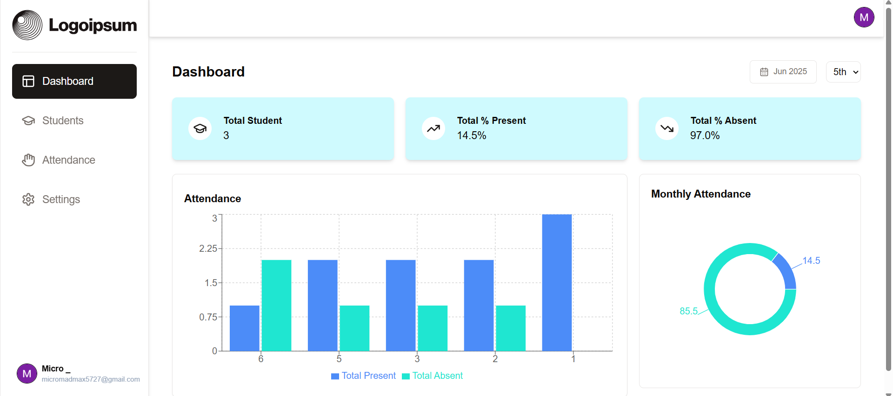

# 🎓 Student Attendance Dashboard

A full-featured student attendance management system built using **Next.js**, **Tailwind CSS**, **Drizzle ORM**, and **PostgreSQL (via Neon)**. This project includes modern UI, robust backend, student record management, and attendance analytics using bar and pie charts.

---

## 🔗 Live Demo

<p>
  <a href="https://google-docs-clone-pied.vercel.app/" target="_blank">
    
  </a>
</p>

---

## 🖼️ UI Preview



---

## 📌 Features

- 🔐 Social + Email/Password Authentication
- 🎨 Responsive UI with Dark Mode using Tailwind CSS
- 🗃️ PostgreSQL Database integration via Neon and Drizzle ORM
- ➕ Add, 🗑️ Delete, and ✏️ Manage Student Records
- 📆 Mark Attendance (Present/Absent) with Date-wise & Monthly Tracking
- 📊 Interactive Dashboard with Bar & Pie Charts
- 🧠 Advanced Logic & Clean Codebase
- 🛠️ Next.js API Route Implementation
- 📺 Step-by-step Tutorial Covered

---

## 🧰 Tech Stack

- **Frontend:** Next.js, Tailwind CSS
- **Authentication:** NextAuth.js
- **Database:** PostgreSQL (hosted on [Neon](https://neon.tech))
- **ORM:** Drizzle ORM
- **Charts:** Chart.js / Recharts

---

## 📦 Installation

### 1. Clone the repository

```bash
git clone https://github.com/your-username/attendance-dashboard.git
cd attendance-dashboard
```

### 2. Install dependencies
```bash
npm install
# or
yarn install
```
### 3. Configure environment variables
Copy the example file and fill in your credentials:
```bash
cp .env.example .env.local
```
Edit .env.local and add your keys from Kinde, and PostgreSQL (Neon):
```bash
# Kinde Auth
KINDE_CLIENT_ID=your_kinde_client_id
KINDE_CLIENT_SECRET=your_kinde_client_secret
KINDE_ISSUER_URL=your_kinde_issuer_url
KINDE_SITE_URL=your_kinde_site_url
KINDE_POST_LOGOUT_REDIRECT_URL=your_post_logout_redirect_url
KINDE_POST_LOGIN_REDIRECT_URL=your_post_login_redirect_url

# PostgreSQL (Neon)
DB_HOST=your_db_host
DB_PORT=your_db_port
DB_USER=your_db_user
DB_PASSWORD=your_db_password
DB_NAME=your_db_name
DATABASE_URL=your_full_database_url
```

### 4. Run the development server
```bash
npm run dev
# or
yarn dev
```
---

## 📤 Deployment

This project is optimized for deployment on **Vercel**. Just push your repository and connect it via your Vercel dashboard.

---

## 🤝 Contributing

Contributions are welcome! Follow these steps:

Fork the repository
Create a new branch (git checkout -b feature/your-feature)
Commit your changes (git commit -m 'Add new feature')
Push to the branch (git push origin feature/your-feature)
Open a Pull Request

---

## 🙌 Acknowledgements
- [Kinde](https://kinde.com/)
- [Recharts](https://recharts.org/)
- [NeonDB](https://neon.com/)
- [Vercel](https://vercel.com/)